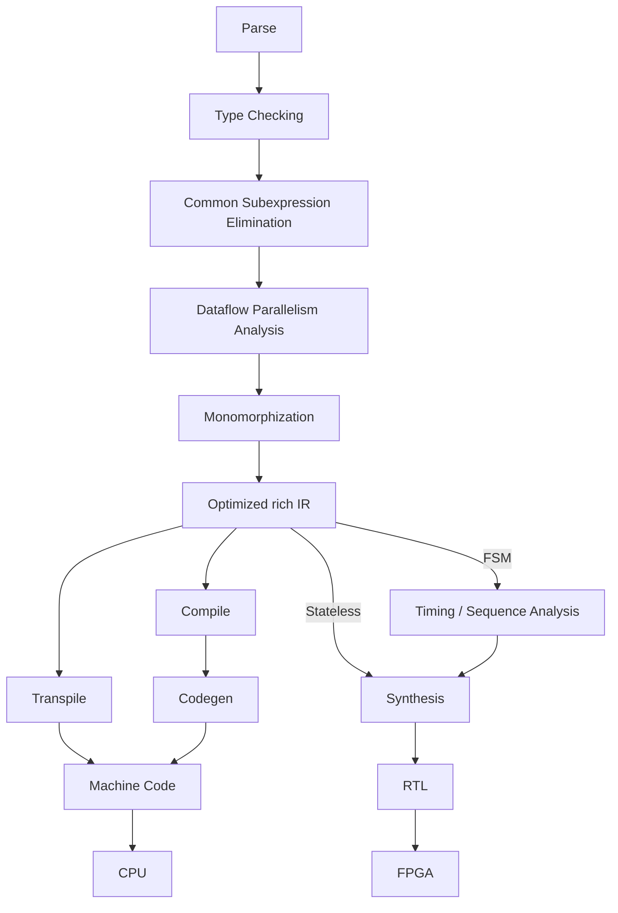

# Paracell

**This is a research project.**

A compiler and synthesizer with

- Dataflow parallelism analysis
- Features from FP to be dataflow-friendly
- High-level synthesis
- Multi-stage programming.

## Overview



## Syntax

```
// Combinational logic.
fun ALU(a: Nat, b: Nat, op: Op) -> Nat {
    match op {
        Op::Add => a + b,
        Op::Sub => a - b,
        Op::Mul => a * b
    }
}

// Sequential logic.
fun Divide(dividend: Nat, divisor: Nat) -> (Nat, Nat, Nat) {
    match divisor {
        0 => (1, 0, 0), // Invalid divisor.
        _ => {
            var quotient = 0;
            var remainder = dividend;

            // FSM must be guaranteed to halt.
            while divisor < remainder {
                quotient = quotient + 1;
                remainder = remainder - divisor;
            };

            (0, quotient, remainder)
        }
    }
}
```

# Parsing

## Semantic layer for different parsers

This package aims to provide a unified AST structure for all types of parsers and kinds of syntax.

### LALRPOP

- [x] flow
- [ ] sexpr
